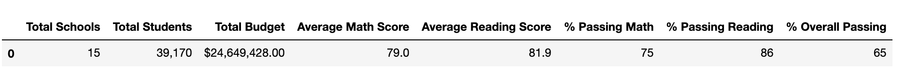
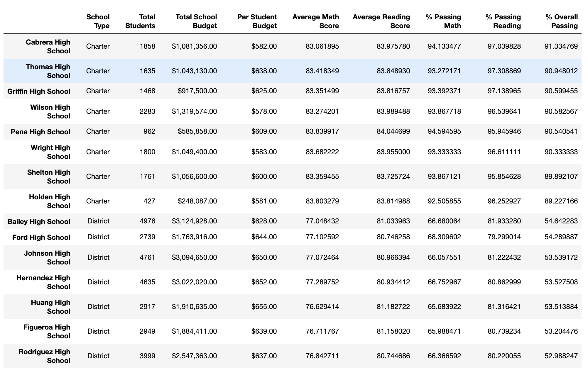
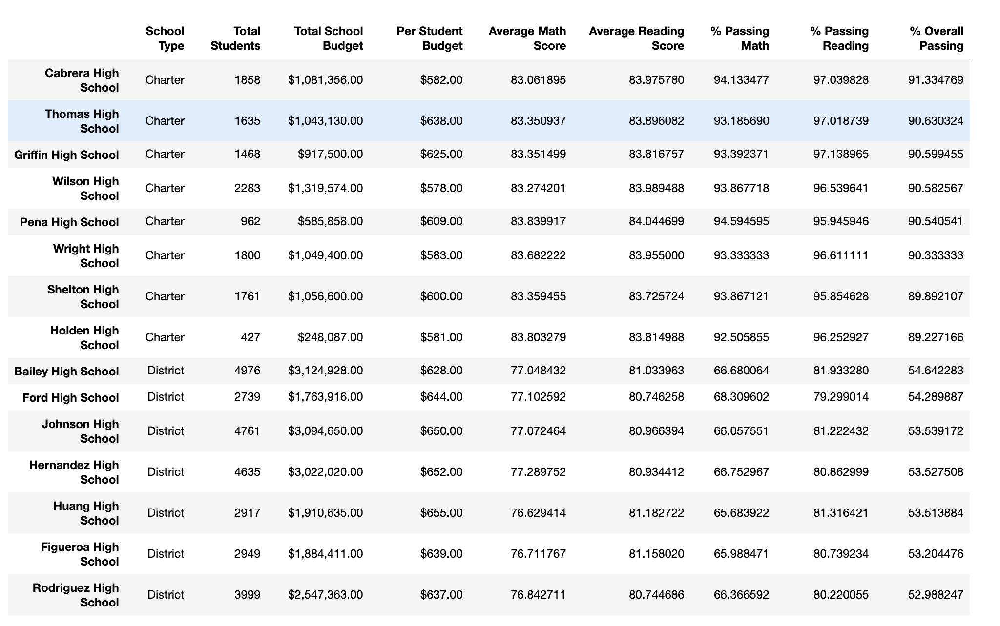
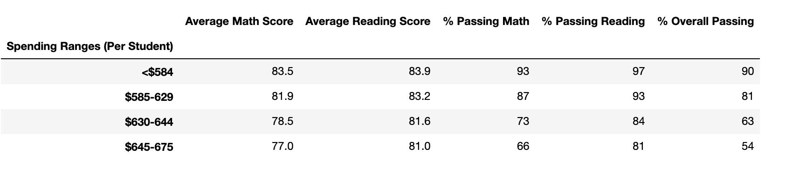
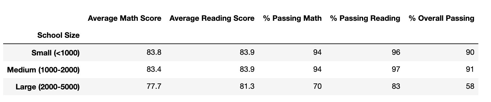
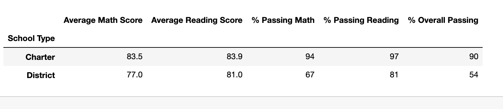

    

# School District Analysis

## OVERVIEW OF THE PROJECT

### Description:

In this project we will be analyzing information from a variety of sources at the school district level on student funding and student standardized test scores.  We will be given access to every student’s math and reading scores and will be reporting to provide insights about performance trends and patterns to help inform discussions and strategic decisions.  

### Purpose:

The purpose of the analysis will assist the school board and superintendent in making decisions regarding school budgets and priorities.  In this task we will be aware of the family’s educational rights which protects the rights of student education records. We will treat the data with confidentiality to protect the students.

### Current situation:

According to the school board, there is evidence of academic dishonesty; specifically, reading and math scores for Thomas High School ninth graders. After we performed the analysis in the initial data, we have been tasked to remove reading and math scores for ninth graders at Thomas High School from the analysis while keeping the rest of the data intact.  We have made the adjustments and will describe how these changes affected the overall results.

### Overview of approach:

Using Python and the Pandas library we were able to read, clean, merge, and analyze two csv files located on the Resources folder; students_complete.csv and schools_complete.csv to gain insights and produce this report. The code used is found in the file PyCitySchools_Challenge.ipynb.

## ANALYSIS AND RESULTS

**1. District summary:**

In the following image we can observe the report of the complete dataset prior to the removal of ninth graders at Thomas High School.  The overall passing is 65%, passing math is 75%, and passing reading 86%.

Note that the overall passing percentage represent the students who passed both math and reading tests.

After removing from our analysis the ninth graders at Thomas High School, we can notice a slight decrease of 0.1% in the overall passing, 0.2% in the passing math, and 0.3% passing reading percentages.

**2. School summary:**

The following image shows us the report on math & reading performance, budget, type of school, and the position of each of the 15 schools in regards to their peers.  The information is sorted in descending order on the **overall passing percentage**, meaning that at the top are the schools with the greatest score. 

As we can see, prior to the removal of ninth graders at Thomas high school the Thomas High Schools ranks second with an **overall passing percentage** of 90.94%.

After the removal of the previously mentioned data, Thomas High School is not affected and still ranks second in relation to the other shcools.  There is a slight reduction on the **overall passing percentage** of 0.31%, passing math percentage of 0.09% and passing reading percentage of 0.29% for that school.  The rest of the schools remain in the same positions.

**3. Analysis of the schools by grade, spending, size, and type:**

**3.1 Math & reading scores by grade:**

9th grade students tend to have a slight lower performance in both math and reading tests compared to the 10th, 11th, and 12th grades. Also, students across all grades show to have higher performance in reading.

<table>
  <tr>
    <td>Math</td>
     <td>Reading</td>
  </tr>
  <tr>
    <td></td>
    <td></td>
  </tr>
 </table>

**3.2 Scores by school spending:** 

The data shows an inverse relationship between spending and performance.  The higher the budget assigned to the schools the lower the performance. It applies for both reading and math.

**3.3 Scores by school size:** 

As we can see small and medium size schools tend to perform better than large schools.

**3.4 Scores by school type:**

Charter schools show a significantly higher performance than District schools.  This gap is more pronounced in math.

## SUMMARY

1. By removing Thomas High School 9th grade test scores from our analysis, we noticed a small impact in the overall performance of the school.

2. After removing from our analysis the ninth graders at Thomas High School, we can notice a slight reduction of 0.1% in the overall passing, 0.2% in the passing math, and 0.3% passing reading percentages.

3. After the removal of the previously mentioned data, Thomas High School is not affected and still ranks second in relation to the other shcools.  There is a slight reduction on the **overall passing percentage** of 0.31%, passing math percentage of 0.09% and passing reading percentage of 0.29% for that school.

4. The removal of 9th graders at THS does not affect significantly the overall scores of school spending, school size, and school type.
