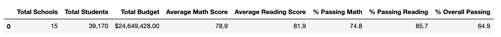

    

# School District Analysis

## OVERVIEW OF THE PROJECT

### Description:

In this project we will be analyzing information from a variety of sources at the school district level on student funding and student standardized test scores.  We will be given access to every student’s math and reading scores and will be reporting to provide insights about performance trends and patterns to help inform discussions and strategic decisions.  

### Purpose:

The purpose of the analysis will assist the school board and superintendent in making decisions regarding school budgets and priorities.  In this task we will be aware of the family’s educational rights which protects the rights of student education records. We will treat the data with confidentiality to protect the students.

### Current situation:

According to the school board, there is evidence of academic dishonesty; specifically, reading and math scores for Thomas High School ninth graders. After we performed the analysis in the initial data, we have been tasked to remove reading and math scores for ninth graders at Thomas High School from the analysis while keeping the rest of the data intact.  We have made the adjustments and will describe how these changes affected the overall results.

### Overview of approach:

Using Python and the Pandas library we were able to read, clean, merge, and analyze two csv files located on the Resources folder; students_complete.csv and schools_complete.csv to gain insights and produce this report.

## ANALYSIS AND RESULTS

1. District summary: 

In the following image we can observe the report of the complete dataset prior to the removal of ninth graders at Thomas High School.  The overall passing is 65%, passing math is 75%, and passing reading 86%.

Note that the overall passing percentage represent the students who passed both math and reading tests.

After removing from our analysis the ninth graders at Thomas High School, we can notice a slight change of -0.1% in the overall passing, -0.2% in the passing math, and -0.3% passing reading percentages.

2. School summary:

The following image shows us the report on math & reading performance, budget, type of school, and the position of each of the 15 schools in regards to their peers.  The information is sorted in descending order on the **overall passing percentage**, meaning that at the top are the schools with the greatest score. 

As we can see, prior to the removal of ninth graders at Thomas high school the Thomas High Schools ranks second with an **overall passing percentage** of 90.94%.

After the removal of the previously mentioned data, Thomas High School is not affected and still ranks second in relation to the other shcools.  There is a slight reduction on the **overall passing percentage** of -0.31%, passing math percentage of -0.09% and passing reading percentage of -0.29% for that school.  The rest of the schools remain in the same positions.

3. Analysis of the schools by grade, spending, size, and type:

-Math scores by grade: 

-Reading scores by grade: 

-Scores by school spending

-Scores by school size

-Scores by school type

{:style="float: right;margin-right: 7px;margin-top: 7px;"}

## Summary: Summarize four major changes in the updated school district analysis after reading and math scores for the ninth grade at Thomas High School have been replaced with NaNs.

Deliverable 3 Requirements
Structure, Organization, and Formatting (7 points)
The written analysis has the following structure, organization, and formatting:

There is a title, and there are multiple sections (2 pt).
Each section has a heading and subheading (3 pt).
Links to images are working, and code is formatted and displayed correctly (2 pt).
Analysis (18 points)
The written analysis has the following:

Overview of the school district analysis:

The purpose of this analysis is well defined (3 pt).
Results:

There is a bulleted list that addresses how each of the seven school district metrics was affected by the changes in the data (10 pt).
Summary:

There is a statement summarizing four major changes to the school district analysis after reading and math scores have been replaced (5 pt).
Submission
Once you’re ready to submit, make sure to check your work against the rubric to ensure you are meeting the requirements for this Challenge one final time. It’s easy to overlook items when you’re in the zone!
